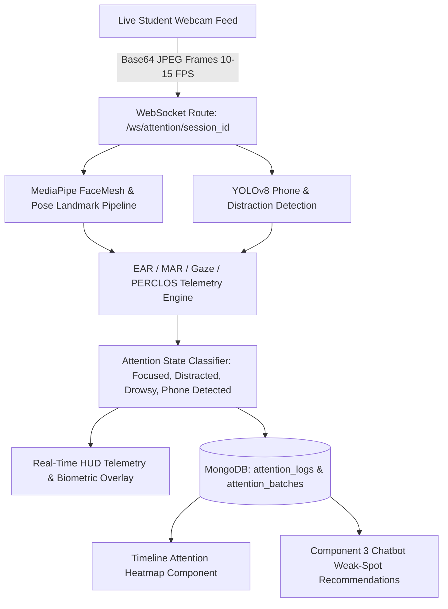

# Component 01: Real-Time Attention Monitoring & Telemetry

## Overview
Component 1 provides non-intrusive, real-time webcam attention monitoring during O/L ICT video lessons. It continuously calculates student attentiveness, eye aspect ratios (EAR), mouth aspect ratios (MAR), gaze directions, and head poses, logging distraction intervals to feed adaptive intervention across the platform.

Frontend implementation: `frontend/src/modules/component-01-attention-monitoring/`  
Backend implementation: `backend/src/modules/component_01_attention_monitoring/`

---

## Active Architecture & Core Concepts

### 1. Vision & Biometric Pipeline
* **Eye Aspect Ratio (EAR)**: Computes eyelid distance to monitor blinks and detect drowsiness.
* **Mouth Aspect Ratio (MAR)**: Monitors yawning frequencies and mouth opening.
* **PERCLOS (Percentage of Eye Closure)**: Rolling calculation tracking prolonged eye closures (`PERCLOS > 0.35` triggers Drowsiness alert).
* **Gaze & Head Pose Vectoring**: Real-time yaw/pitch/roll tracking detecting when a student looks away from the screen (`Gaze Deviation`).
* **Object Detection (YOLOv8)**: Detects smartphone usage and unauthorized devices in the learning field.

### 2. Live Telemetry & HUD Overlays
* **Biometric Scanline & Gaze Radar**: High-tech HUD visualizing gaze direction and EAR/MAR gauges in real time.
* **Attention Score Gauge**: Continuous 0–100% attention stability metric.
* **Dedicated Focus**: Purely focused on attentiveness, posture, and distraction events (live sign recognition badge removed to keep telemetry dedicated to attention).

### 3. Data Integration with Other Components
* **Attention Heatmap**: Distraction timestamps are mapped directly against the video timeline on `/lesson`.
* **Component 3 Remediation**: Low-attention timestamps automatically trigger syllabus weak-spot suggestions in the Adaptive Chatbot.
* **Component 5 Haptic Feedback**: Prolonged distraction triggers wristband vibration alerts via ESP32 BLE.

---

## API & WebSocket Endpoints

| Method / Protocol | Endpoint | Description |
| :--- | :--- | :--- |
| `WebSocket` | `/ws/attention/{session_id}` | Real-time frame ingestion, telemetry computation, and HUD status streaming |
| `POST` | `/api/attention/batch` | Bulk upload of offline attention telemetry data |
| `GET` | `/api/attention/history/{student_id}` | Retrieves student historical attention sessions |
| `GET` | `/api/attention/reports/summary` | Admin & teacher summary analytics on student focus |
