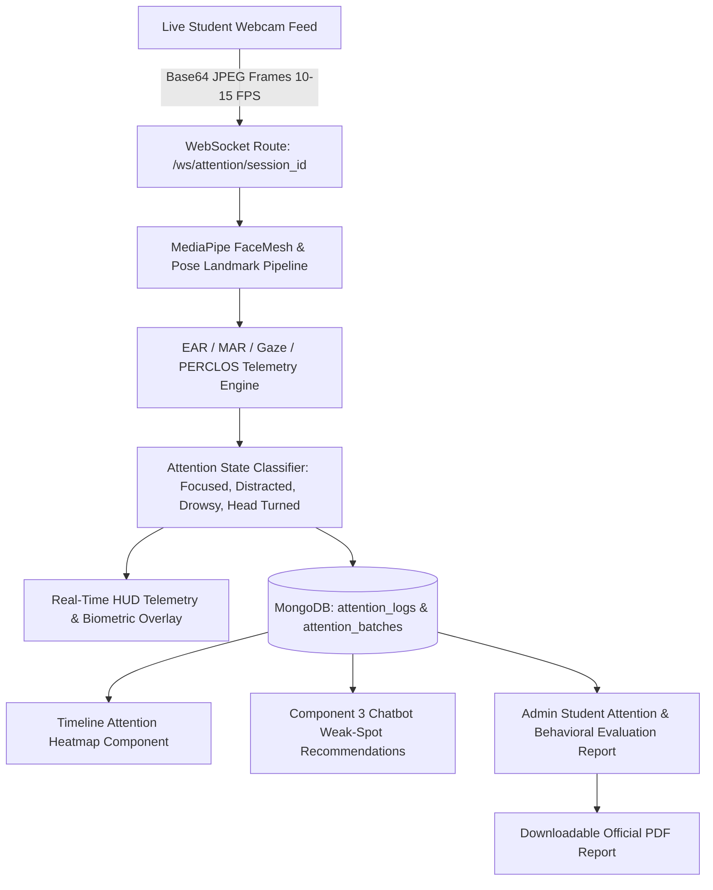

# Component 01: Real-Time Attention Monitoring & Behavioral Telemetry

## Overview
Component 1 provides non-intrusive, real-time webcam attention monitoring during O/L ICT video lessons. It continuously calculates student attentiveness, eye aspect ratios (EAR), mouth aspect ratios (MAR), gaze directions, and head poses, logging distraction intervals to feed adaptive intervention across the platform and generating administrative behavioral evaluation reports.

Frontend implementation: `frontend/src/modules/component-01-attention-monitoring/`  
Backend implementation: `backend/src/modules/component_01_attention_monitoring/`

---

## Active Architecture & Core Concepts

### 1. Vision & Biometric Pipeline
* **Eye Aspect Ratio (EAR)**: Computes Euclidean distance between upper/lower eyelid landmarks against horizontal eye width:
  $$\text{EAR} = \frac{\|p_2 - p_6\| + \|p_3 - p_5\|}{2 \|p_1 - p_4\|}$$
* **Mouth Aspect Ratio (MAR)**: Monitors vertical mouth opening against lip width to identify yawns and speech:
  $$\text{MAR} = \frac{\|m_2 - m_8\| + \|m_3 - m_7\| + \|m_4 - m_6\|}{2 \|m_1 - m_5\|}$$
* **PERCLOS (Percentage of Eye Closure)**: Rolling window metric tracking prolonged eyelid closure ($\text{PERCLOS} > 0.35$ triggers Drowsiness alert).
* **Gaze & Head Pose Vectoring**: Real-time 3D yaw, pitch, and roll calculation via solvePnP to detect when a student looks away from the screen (`Gaze Deviation` / `Head Turned`).

### 2. Live Telemetry & HUD Overlays
* **Biometric Scanline & Gaze Radar**: High-tech HUD visualizer displaying gaze direction, EAR/MAR gauges, and live facial mesh in real time.
* **Attention Score Gauge**: Continuous 0–100% smoothed attention stability metric computed per frame batch.
* **Distraction Timeline & Heatmap**: Color-coded video timeline segments indicating attentive intervals vs distraction checkpoints.

### 3. Student Attention & Behavioral Admin Reports
* **Administrative Analytics**: Centralized dashboard ([AdminAttentionReportsPage.jsx](file:///g:/projectRP/frontend/src/modules/component-01-attention-monitoring/pages/AdminAttentionReportsPage.jsx)) allowing teachers and administrators to inspect student focus profiles.
* **Comprehensive Metrics**:
  * **Overall Engagement Score** (%)
  * **Attentive Duration & Percentage** (%)
  * **Drowsiness (PERCLOS) Trigger Counts**
  * **Behavioral Distribution Breakdown** (Attentive, Head Turned, Drowsy, Yawning, Eyes Closed, No Face Visible)
  * **Recorded Session Timeline Logs**
* **PDF Report Generation**: Printable, formatted A4 assessment reports for academic reviews and parental feedback.

### 4. Cross-Component Integrations
* **Component 3 Remediation**: Low-attention timestamps automatically feed into the Adaptive Chatbot to recommend syllabus weak-spot reviews.
* **Component 5 Haptic Alerts**: Prolonged drowsiness or distraction triggers physical vibration alerts on the ESP32 smart wristband.

---

## API & WebSocket Endpoints

| Method / Protocol | Endpoint | Description |
| :--- | :--- | :--- |
| `WebSocket` | `/ws/attention/{session_id}` | Real-time frame ingestion, telemetry computation, and HUD status streaming |
| `POST` | `/api/attention/batch` | Bulk upload of offline attention telemetry sessions |
| `GET` | `/api/attention/history/{student_id}` | Retrieves student historical attention sessions |
| `GET` | `/api/attention/admin/reports/{user_id}` | Full student attention and behavioral evaluation report |
| `GET` | `/api/attention/admin/users` | List of all enrolled students with aggregate engagement scores |
| `GET` | `/api/missed-segments/{user_id}` | Missed video lesson intervals based on recorded attention drops |
