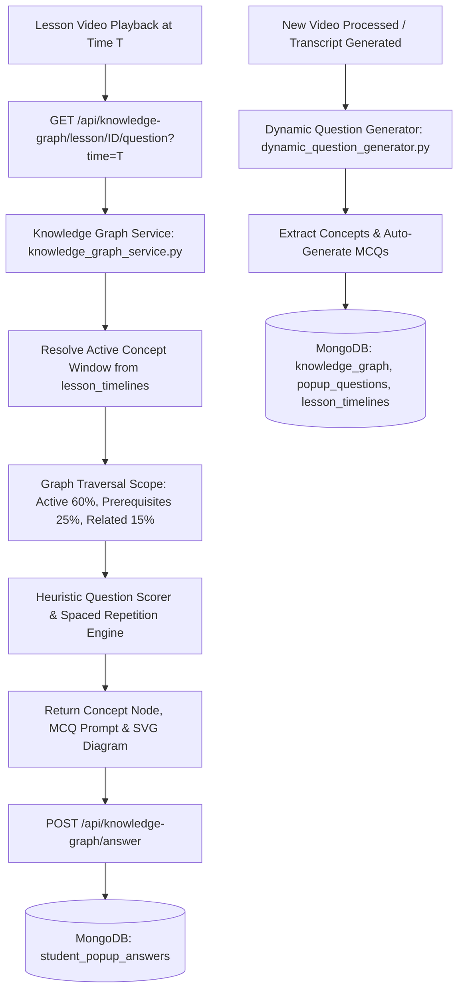

# Component 02: Knowledge Graph Driven Popup Question System

## Overview
Component 2 delivers concept-aware, adaptive popup questions and concept diagrams during O/L ICT video playback. Instead of displaying static or random questions, the backend dynamically maps video playback timestamps to curriculum nodes in an intelligent Knowledge Graph. It selects questions based on a weighted graph-neighborhood algorithm (GQSA) and dynamically generates new nodes and MCQs from video transcripts.

Frontend implementation: `frontend/src/modules/component-02-knowledge-graph-question-system/`  
Backend implementation: `backend/src/modules/component_02_knowledge_graph_question_system/`

---

## Active Architecture & Core Concepts

---

## 1. Graph-Based Question Selection Algorithm (GQSA)

When a student reaches a timestamp window in the lesson, the algorithm assigns weights across the Knowledge Graph neighborhood:
* **Current Active Concept**: `60% Weight` (Tests comprehension of what was just explained).
* **Prerequisite Concepts**: `25% Weight` (Ensures student has foundational mastery before progressing).
* **Related Concepts**: `15% Weight` (Encourages transfer of learning and lateral thinking).

### Selection & Spaced Repetition Priority:
1. **Unanswered Candidates**: High-yield unanswered questions in the active neighborhood.
2. **Review Candidates**: If all questions in the neighborhood were answered, spaced repetition schedules review for questions previously failed.
3. **Difficulty Escalation**: Gradually increases question difficulty (`Basic` -> `Intermediate` -> `Advanced`) based on student success rate.

---

## 2. Dynamic Video Transcript Generator (Zero Hardcoding)

In addition to the national O/L ICT seed dataset, [dynamic_question_generator.py](file:///g:/projectRP/backend/src/modules/component_02_knowledge_graph_question_system/services/dynamic_question_generator.py) enables fully automated, dynamic creation:
* Automatically extracts key concepts from newly uploaded video transcripts.
* Generates 4 distractor options and explanations per segment.
* Upserts dynamic nodes directly into MongoDB collections (`knowledge_graph`, `popup_questions`, `lesson_timelines`).

---

## 3. Knowledge Graph Curriculum Nodes

Contains 15 structured O/L ICT core syllabus concepts:
1. **Introduction to ICT**
2. **Computer Hardware & Von Neumann Architecture**
3. **Computer Software & OS Classification**
4. **Operating Systems & File Systems**
5. **Data & Information Representation**
6. **Number Systems (Binary, Octal, Hexadecimal)**
7. **Logic Gates & Truth Tables**
8. **Computer Networks & Topologies**
9. **Internet, Protocols (TCP/IP, HTTP, DNS) & Email**
10. **Cyber Security, Malware & Ethics**
11. **Word Processing & Desktop Publishing**
12. **Spreadsheet Formulas & Data Analysis**
13. **Database Management & SQL Keys (Primary, Foreign)**
14. **Programming Principles & Control Structures**
15. **Algorithms & Flowcharts**

---

## 4. Live MongoDB Collections

* `knowledge_graph`: Concept nodes, descriptions, prerequisites, related concepts, and SVG diagram data.
* `popup_questions`: Multiple-choice questions, options, correct answers, explanations, and difficulty ratings.
* `lesson_timelines`: Video playback time intervals mapped to concept IDs.
* `student_popup_answers`: Student answer attempts, accuracy scores, and review intervals.

---

## API Endpoints

| Method | Endpoint | Description |
| :--- | :--- | :--- |
| `GET` | `/api/knowledge-graph` | Retrieves the full O/L ICT syllabus knowledge graph hierarchy |
| `GET` | `/api/knowledge-graph/concept/{concept_id}` | Retrieves concept node details and prerequisites |
| `GET` | `/api/knowledge-graph/lesson/{lesson_id}/question` | Selects adaptive popup question for current playback second |
| `GET` | `/api/knowledge-graph/lesson/{lesson_id}/timeline` | Returns timeline checkpoints and concept mapping |
| `POST` | `/api/knowledge-graph/answer` | Evaluates student answer submission, calculates score, and logs attempt |
| `GET` | `/api/knowledge-graph/diagram/{concept_id}` | Retrieves structured SVG/interactive visual diagram for the concept |
