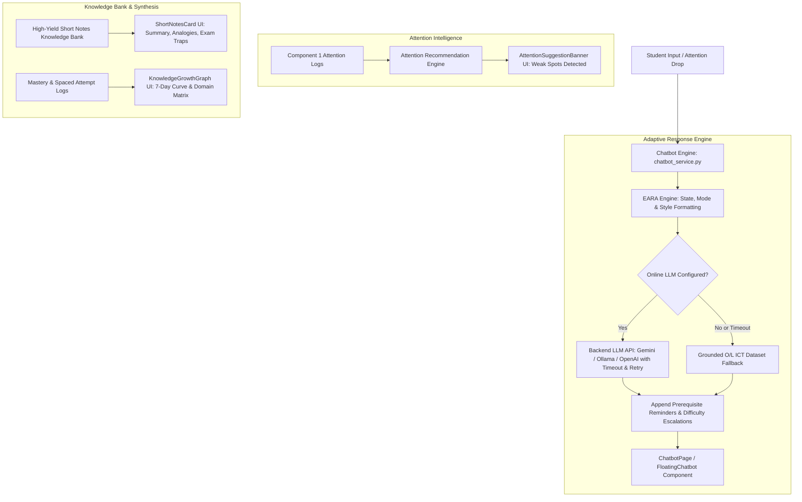

# Component 03: Emotion-Aware Adaptive Chatbot with Knowledge Growth & Attention-Driven Revision

## Overview
Component 3 is an advanced AI learning assistant for Sri Lankan O/L ICT students. It combines real-time attention feedback from Component 1, syllabus-grounded Knowledge Graph concepts from Component 2, interactive High-Yield Short Notes, and visual Knowledge Growth matrices with an Emotion-Aware Response Adaptation (EARA) engine.

Frontend implementation: `frontend/src/modules/component-03-adaptive-chatbot/`  
Backend implementation: `backend/src/modules/component_03_adaptive_chatbot/`

---

## Active Architecture & Core Concepts

---

## 1. Attention-Aware Concept & Lesson Recommendations
* **Pipeline**: Queries the `attention_logs` MongoDB collection to identify video segments where the student experienced gaze deviations, phone distractions, or PERCLOS drowsiness.
* **Smart Remediation**: Maps distraction timestamps to corresponding O/L ICT concepts and suggests direct chat prompts (*"Let's review Von Neumann Architecture"*).
* **UI**: [AttentionSuggestionBanner.jsx](file:///g:/projectRP/frontend/src/modules/component-03-adaptive-chatbot/components/Chatbot/AttentionSuggestionBanner.jsx) displays weak spots with 1-click *Short Note* and *Review in Chat* action buttons.
* **Endpoint**: `GET /api/chatbot/attention-recommendations/{student_id}`

---

## 2. High-Yield O/L Instant Short Notes
* **Structured Revision Matrix**: High-yield syllabus summaries organized into:
  * **Core Definition & Key Takeaways**
  * **Real-World Analogy** (e.g. *Flour/Sugar vs Baked Cake for Data vs Information*)
  * **O/L Exam Marking Tips & Traps to Avoid**
  * **Memory Mnemonics / Hooks** (e.g. *B-K-M-G-T for byte capacity multipliers*)
* **UI**: [ShortNotesCard.jsx](file:///g:/projectRP/frontend/src/modules/component-03-adaptive-chatbot/components/Chatbot/ShortNotesCard.jsx) with 1-click clipboard copy and direct *Quiz Me* integration.
* **Endpoint**: `GET /api/chatbot/short-notes/{topic_id}`

---

## 3. Visual Knowledge Growth & Concept Mastery Matrix
* **Multi-Dimensional Student Model**:
  * **Overall Mastery Score (0–100%)**: Aggregated across quizzes, chat interactions, and micro-challenges.
  * **Attention Correlation Index**: Correlates webcam attention stability with syllabus mastery.
  * **Domain Mastery Breakdown**: Levels assigned per topic (*Master*, *Proficient*, *Developing*, *Novice*).
  * **7-Day Progress Trend**: Dual-metric chart tracking growth over time.
* **UI**: [KnowledgeGrowthGraph.jsx](file:///g:/projectRP/frontend/src/modules/component-03-adaptive-chatbot/components/Chatbot/KnowledgeGrowthGraph.jsx).
* **Endpoint**: `GET /api/chatbot/knowledge-growth/{student_id}`

---

## 4. Multi-Style Explain Modes

Students can toggle explain styles dynamically:
1. **✨ Standard**: Balanced syllabus explanation adhering to National Institute of Education (NIE) guidelines.
2. **🧒 Simple (ELI10)**: Simplified language using everyday terms.
3. **💡 Real-World Analogy**: Grounded in relatable physical analogies.
4. **🎯 O/L Exam Focus**: Compressed, high-yield bullet points highlighting marking scheme expectations and common past-paper traps.

---

## 5. EARA (Emotion-Aware Response Adaptation) Engine

Adjusts tone and support based on student learning state:
* **`not_understanding`**: Offers supportive tone, simplifies terms, and inserts prerequisite refresh points.
* **`distracted`**: Returns concise, high-contrast bullet points.
* **`bored`**: Injects engaging real-world scenarios and interactive challenges.
* **`understanding`**: Elevates difficulty with extension questions and past-paper prompts.

---

## 6. O/L Past Paper Auto-Grader & Marking Scheme Evaluator
* **Functionality**: Evaluates student open-ended answers against official Department of Examinations marking criteria.
* **Marking Engine**: Awards marks (e.g. `3/4`), highlights matched vs missing keywords, and displays the official model answer.
* **Endpoint**: `GET /api/chatbot/past-paper/questions`, `POST /api/chatbot/past-paper/evaluate`
* **UI**: [PastPaperGraderModal.jsx](file:///g:/projectRP/frontend/src/modules/component-03-adaptive-chatbot/components/Chatbot/PastPaperGraderModal.jsx)

---

## 7. Interactive AI Flashcard Deck (SM-2 Spaced Repetition)
* **Functionality**: 3D flip flashcards covering definitions, logic gates, acronyms, and SQL rules.
* **SuperMemo SM-2**: Schedules review intervals (`1d`, `3d`, `7d`) based on student rating (*Hard*, *Good*, *Easy*).
* **Endpoint**: `GET /api/chatbot/flashcards/{topic_id}`, `POST /api/chatbot/flashcards/review`
* **UI**: [FlashcardDeckModal.jsx](file:///g:/projectRP/frontend/src/modules/component-03-adaptive-chatbot/components/Chatbot/FlashcardDeckModal.jsx)

---

## 8. 10-Minute Rapid-Fire O/L Mock Exam Simulator
* **Functionality**: Timed 10-question adaptive exam with countdown timer and automatic grading.
* **Grade Predictor**: Predicts O/L Grade (`A Distinction`, `B`, `C`, `S`, `W`) and generates a personalized study prescription.
* **Endpoint**: `GET /api/chatbot/mock-exam/start`, `POST /api/chatbot/mock-exam/submit`
* **UI**: [MockExamModal.jsx](file:///g:/projectRP/frontend/src/modules/component-03-adaptive-chatbot/components/Chatbot/MockExamModal.jsx)

---

## 9. In-Chat Quick Sign Translation & Algorithm Visualizer
* **In-Chat Quick Sign Translation**: Keywords like *CPU*, *Database*, *Network*, *Internet* display an interactive `[🤟 Sign]` badge triggering sign avatar previews ([SignWordBadge.jsx](file:///g:/projectRP/frontend/src/modules/component-03-adaptive-chatbot/components/Chatbot/SignWordBadge.jsx)).
* **Flowchart & Algorithm Visualizer**: Chatbot automatically structures algorithm responses using formatted SVG diagrams and step-by-step logic traces.

---

## API Endpoints Catalog

| Method | Endpoint | Description |
| :--- | :--- | :--- |
| `POST` | `/api/chatbot/ask` | Main adaptive chat endpoint supporting EARA and explain modes |
| `GET` | `/api/chatbot/attention-recommendations/{student_id}` | Retrieves low-attention lesson segments and revision prompts |
| `GET` | `/api/chatbot/short-notes/{topic_id}` | Generates structured high-yield O/L short notes |
| `GET` | `/api/chatbot/knowledge-growth/{student_id}` | Retrieves mastery scores, attention correlation, and 7-day trend |
| `GET` | `/api/chatbot/past-paper/questions` | Returns list of standard O/L ICT past paper questions |
| `POST` | `/api/chatbot/past-paper/evaluate` | Evaluates past paper answer against official rubric |
| `GET` | `/api/chatbot/flashcards/{topic_id}` | Returns flashcard deck for topic |
| `POST` | `/api/chatbot/flashcards/review` | Submits SM-2 spaced repetition review rating |
| `GET` | `/api/chatbot/mock-exam/start` | Initializes a timed 10-minute mock exam |
| `POST` | `/api/chatbot/mock-exam/submit` | Grades mock exam and outputs predicted O/L grade (A-W) |
| `GET` | `/api/chatbot/topics` | Retrieves list of all supported O/L ICT topics |
| `POST` | `/api/chatbot/micro-challenge` | Returns optional prerequisite micro-challenge |
| `POST` | `/api/chatbot/check-challenge` | Evaluates micro-challenge answer |

| `GET` | `/api/chatbot/analytics/teacher` | Teacher dashboard analytics (understanding scores, weak areas) |
| `GET` | `/api/chatbot/analytics/report/pdf` | Generates downloadable PDF analytics report |
