# Component 05: Smart Haptic Wristband IoT & Interactive Sign Course Practice Arena

## Overview
Component 5 integrates IoT wearable haptic feedback with an interactive sign language learning course. It provides physical vibration alerts and OLED telemetry via ESP32 BLE for attention and learning events, alongside a gamified camera-based sign practice arena where students practice ICT sign language terms evaluated by real-time hand landmark classification.

Frontend implementation: `frontend/src/modules/component-05-smart-wristband-iot/`  
Backend implementation: `backend/src/modules/component_05_smart_wristband_iot/`

---

## Active Architecture & Core Concepts

```mermaid
graph TD
    subgraph IoT Wearable Feedback
        SysAlert[System Alert: Distraction / Quiz / Chatbot / Sign Replay] --> WBServ[Wristband Service: wristband_service.py]
        WBServ --> Preset[Vibration Preset & OLED Formatting]
        Preset --> BLE[ESP32 BLE / Serial Transmitter: SmartHapticWristband.ino]
        BLE --> Motor[Haptic Vibration Motor + 0.96 inch SSD1306 OLED Display]
    end

    subgraph Interactive Sign Course Arena
        CourseUI[SignCoursePage & SignPracticeArena.jsx] --> MediaPipe[Live Webcam Hand Landmark Tracking]
        MediaPipe --> Evaluator[CameraSignEvaluator.jsx: Pose & Angles]
        Evaluator --> PassFail[Accuracy Calculation & Instant Feedback]
        PassFail -->|Pass| CourseProg[Update Unit Progress & Unlock Next Sign]
        PassFail -->|Error| ErrorAlert[Trigger Wristband Haptic Buzz]
        CourseProg --> Cert[CourseCertificateModal: Issue Verified Course Certificate]
    end
```

---

## 1. Smart Haptic Wristband IoT Module

* **Hardware Stack**: ESP32 microcontroller, SSD1306 I2C OLED Display (128x64), Coreless ERM/LRA Haptic Vibration Motor, BLE 4.2 / WiFi.
* **Firmware**: [SmartHapticWristband.ino](file:///g:/projectRP/backend/src/modules/component_05_smart_wristband_iot/firmware/SmartHapticWristband.ino).
* **Vibration Patterns**:
  * `Short Pulse` (200ms) — Popup Question prompt
  * `Double Pulse` (550ms) — Chatbot response / reminder
  * `Long Pulse` (1000ms) — Distraction / Gaze deviation alert
  * `Short + Long` (1100ms) — Missed lesson segment
  * `Repeated Pulse` (1200ms) — Wrong sign attempt
  * `Emergency Pulse` (1800ms) — Sign Avatar replay requested
* **Web Telemetry**: [VirtualWristbandModal.jsx](file:///g:/projectRP/frontend/src/modules/component-05-smart-wristband-iot/components/Wristband/VirtualWristbandModal.jsx) and [WristbandPreview.jsx](file:///g:/projectRP/frontend/src/modules/component-05-smart-wristband-iot/components/Wristband/WristbandPreview.jsx) provide interactive live hardware simulation in the browser.

---

## 2. Interactive Sign Language Course & Camera Practice Arena

* **Curriculum Units**: Structured O/L ICT sign curriculum covering Computer Hardware, Software, Networking, Databases, and Security.
* **Dual-View Practice Arena**: Side-by-side upper-body sign avatar demonstration ([SignAvatarDemo.jsx](file:///g:/projectRP/frontend/src/modules/component-05-smart-wristband-iot/components/SignCourse/SignAvatarDemo.jsx)) and student camera evaluator ([CameraSignEvaluator.jsx](file:///g:/projectRP/frontend/src/modules/component-05-smart-wristband-iot/components/SignCourse/CameraSignEvaluator.jsx)).
* **Real-Time Evaluation**: Analyzes hand finger extension states, palm orientations, and movement speed to output a 0–100% accuracy score.
* **Course Completion & Certification**: Verifies mastery of all curriculum modules and generates a downloadable completion certificate ([CourseCertificateModal.jsx](file:///g:/projectRP/frontend/src/modules/component-05-smart-wristband-iot/components/SignCourse/CourseCertificateModal.jsx)).

---

## API Endpoints

| Method | Endpoint | Description |
| :--- | :--- | :--- |
| `GET` | `/api/wristband/device/{student_id}` | Retrieves connected wristband status and battery levels |
| `GET` | `/api/wristband/config/{student_id}` | Retrieves student customized haptic vibration presets |
| `POST` | `/api/wristband/config` | Saves vibration intensity, duration, and custom OLED messages |
| `POST` | `/api/wristband/test` | Dispatches test vibration pulse to the wearable |
| `GET` | `/api/wristband/history/{student_id}` | Retrieves log of dispatched haptic notifications |
| `DELETE`| `/api/wristband/history/{student_id}` | Clears notification event history |
| `GET` | `/api/sign-course/modules` | Retrieves full syllabus course units and sign keywords |
| `GET` | `/api/sign-course/progress/{student_id}` | Retrieves student completed signs, streak, and quiz scores |
| `POST` | `/api/sign-course/progress` | Updates keyword pass status and module completion |
