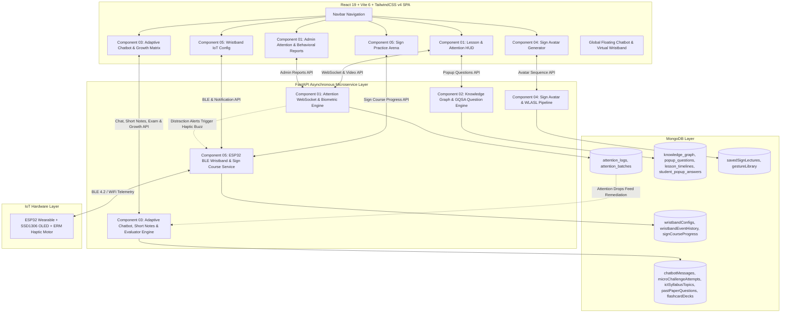

# SignLearn AI — System Architecture & Inter-Component Integration

## Architecture Diagram

---

## Inter-Component Data Flows

1. **Component 1 -> Component 3 (Attention-Aware Remediation)**:
   * Real-time webcam telemetry logs distraction/drowsiness segments into `attention_logs`.
   * Component 3 queries these logs via `GET /api/chatbot/attention-recommendations/{student_id}` to generate targeted syllabus review prompts.

2. **Component 1 -> Component 5 (Haptic Distraction Alert)**:
   * When severe drowsiness (`PERCLOS > 0.35`) or head deviation occurs, an alert triggers the ESP32 wristband motor to vibrate with a `Long Pulse (1000ms)`.

3. **Component 1 -> Admin Evaluation (Student Attention Reports)**:
   * Telemetry logs aggregate into official PDF student evaluation reports via `GET /api/attention/admin/reports/{user_id}`.

4. **Component 1 -> Component 2 (Lesson Timeline Synchronization)**:
   * Video playback time `t` continuously queries `GET /api/knowledge-graph/lesson/{lesson_id}/question?time=t`.
   * Component 2 traverses the Knowledge Graph neighborhood to present adaptive multiple-choice checkpoints.

5. **Component 4 -> Component 5 (Sign Course Practice Integration)**:
   * Component 4 provides upper-body sign avatar demonstrations inside Component 5's Sign Practice Arena.
   * Student attempts are evaluated by webcam hand landmark classification and reinforced via wristband haptics.
